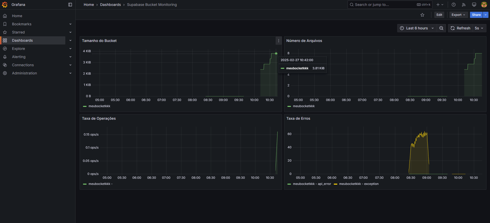
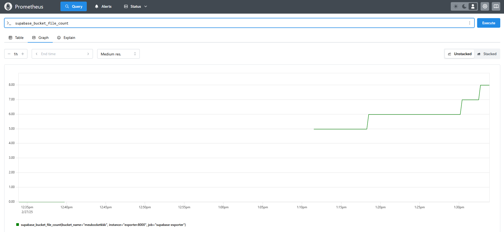

# Documentação do Dashboard de Monitoramento do Supabase Bucket

## 1. Compreensão dos Dados

O dashboard monitora um bucket do Supabase e apresenta informações relevantes sobre sua utilização. Ele inclui o tamanho do bucket, que indica a quantidade de dados armazenados ao longo do tempo, o número de arquivos, que exibe a contagem de arquivos no bucket, a taxa de operações, que mede a quantidade de operações por segundo no bucket, e a taxa de erros, que registra falhas e exceções encontradas durante o uso. Esses dados permitem uma compreensão clara sobre a evolução do armazenamento, a frequência de acessos e possíveis falhas no bucket.

## 2. Seleção de Métricas Relevantes

Foram escolhidas métricas essenciais para um monitoramento eficaz, como o uso de espaço para verificar o crescimento do armazenamento, a quantidade de arquivos para entender a dinâmica de adição e remoção de conteúdo, a taxa de operações para mensurar a atividade no bucket e a taxa de erros para identificar problemas e permitir intervenções rápidas. Essas métricas garantem um panorama completo do estado e desempenho do bucket.

## 3. Eficiência na Integração de Dados

Os dados foram integrados ao Grafana utilizando o Supabase como fonte de dados, garantindo acesso em tempo real. Consultas eficientes foram implementadas para otimizar a recuperação e exibição das métricas, além de ajustes de intervalo de tempo que permitem uma análise mais precisa da história do bucket. A integração foi realizada de forma eficiente, garantindo dados atualizados e consistentes no dashboard.

## 4. Design e Usabilidade do Dashboard

O dashboard foi projetado com um design limpo e intuitivo, com gráficos bem distribuídos para facilitar a leitura das métricas, cores diferenciadas para distinguir operações normais de erros, opção de ajuste de período para melhor análise dos dados e atualização automática a cada 5 segundos para exibição em tempo real. O layout proporciona uma experiência de usuário eficaz, permitindo uma rápida identificação de tendências e problemas.

---

## 5. Análise e Interpretação dos Resultados

A análise dos dados revelou um crescimento constante no tamanho do bucket, indicando aumento de armazenamento, elevação no número de arquivos, sugerindo maior upload de conteúdo, baixa taxa de operações, indicando uma utilização moderada, e picos na taxa de erros, que podem indicar falhas ou exceções que precisam de investigação. Com base nesses insights, é possível planejar melhor o armazenamento e solucionar problemas com rapidez.

